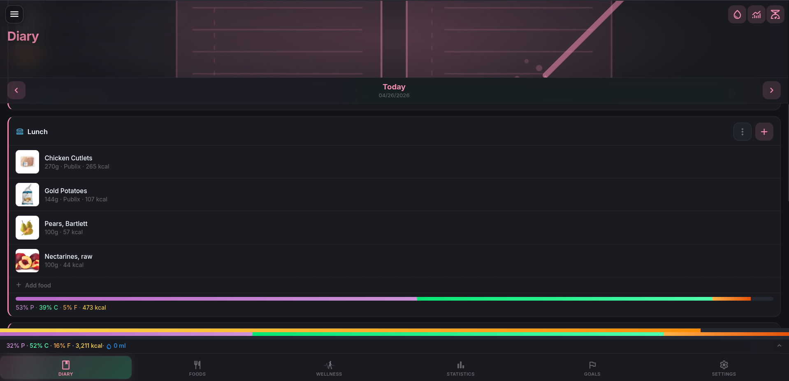
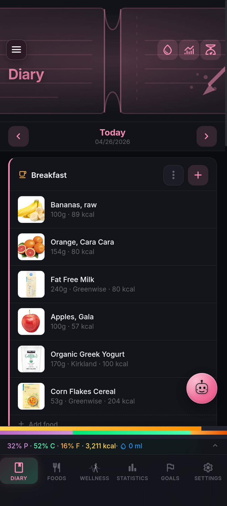
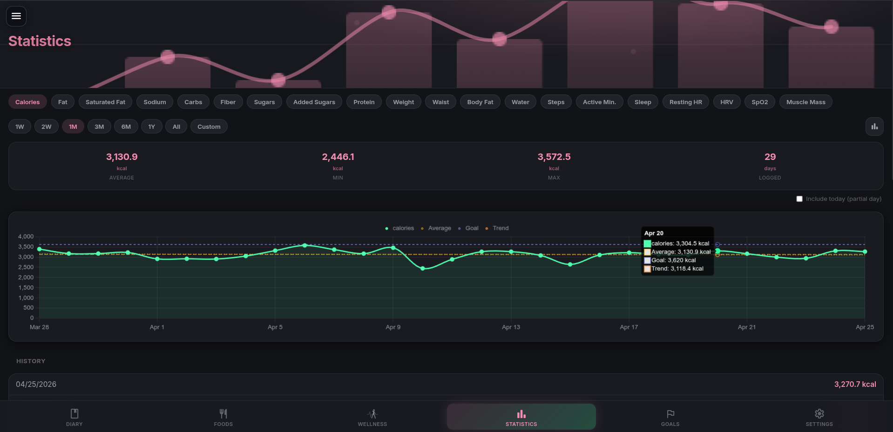
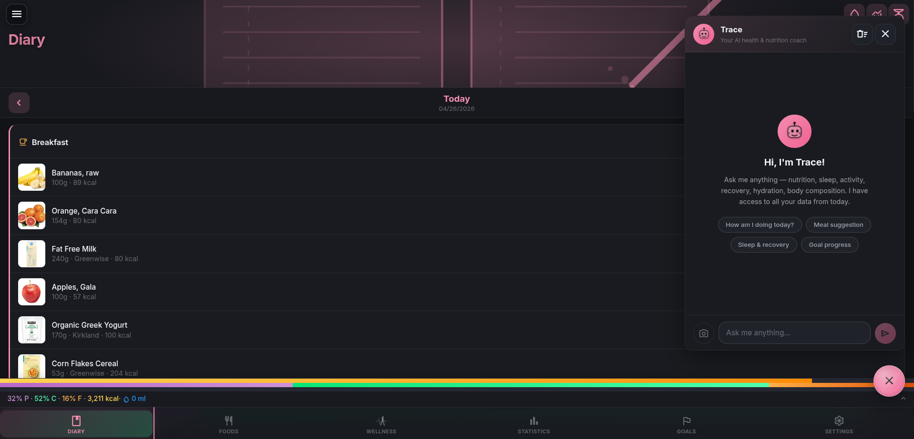
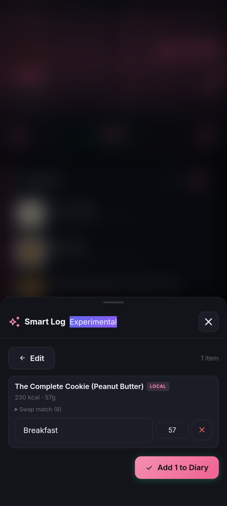
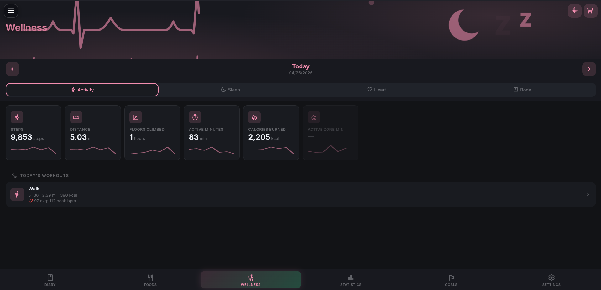

# NutriTrace

**Trace Every Bite** — A self-hosted personal nutrition tracker built for privacy and full data ownership.

NutriTrace runs as a single Docker container on your own hardware, with a PWA for the browser and a native Android app for your phone. No accounts on external services, no data leaving your network, no subscriptions.

---

## Principles

- **Self-hosting is and will remain free.** The server, PWA, and source code will never be paywalled.
- **No trackers, no analytics, no telemetry.** NutriTrace doesn't phone home — your usage is invisible to anyone but you.
- **Your data stays on your hardware.** No central server, no cloud sync that can read it; nothing leaves your network unless you opt into a third-party integration (OFF, USDA, Fitbit, etc.).
- **Open source under AGPL-3.0.** Every line that touches your data is readable.

> **Offline-first by design.** NutriTrace ships with a built-in seed database of **542 raw ingredients** (IFCT 2017) and **984 home-cooked recipes** (INDB 2024.11) — all core features work offline with no internet connection required. Branded and packaged foods can be added on demand via the built-in label scanner.

---



---

## Features

### Diary
- Daily food diary with configurable meals (Breakfast, Lunch, Dinner, Snacks, or fully custom)
- Quick-add foods, meals, and recipes with portion scaling and a live nutrition preview (calories + protein, carbs, fat update as you change quantity, unit, or number of servings); food notes (e.g. "1 serving = 150g cooked") are surfaced at add time
- Nutrition bar with macro summary and per-meal breakdowns
- Body stats tracking (weight, measurements, and more) with customizable fields
- Water intake tracking with configurable containers and daily goal
- Long-press (mobile) or right-click (desktop) for item edit/move/delete actions
- Per-meal ⋮ menu: copy or move all items to another meal, copy the meal to another date, save the meal to your library, or clear it
- **Split Recipe** — break a logged recipe into its component ingredients in place, with each child editable (swap quantity, remove one) while macros stay accurate
- Optional **Activity** section: log workouts manually (name, calories, duration, distance) without a wearable — Trace can estimate calories from your body profile when you describe a workout in plain language
- Optional **Intermittent Fasting tracker**: a top-of-Diary widget with goal presets (14:10 / 16:8 / 18:6 / 20:4 / OMAD / custom), live elapsed timer, progress bar, and goal-reached notification. Stats card on the Statistics page shows your 14-day chart, average duration, longest fast, current streak, and longest streak. Trace AI can answer "what's my fasting streak?" via a built-in tool.
- Per-day free-text notes (e.g. "felt bloated after lunch", "post-workout") — toggleable, with an indicator on dates that have a note

<p align="center">
  
</p>

### Foods & Meals
- Personal food database with photos, barcodes, categories, and custom labels
- Favorite foods and meals (star them) with a configurable sort order — favorites first, alphabetical, recently used, or most used
- Barcode scanner (camera) for quick food lookup via Open Food Facts. Barcodes not in OFF open the food editor with the barcode prefilled so you can enter the food manually and contribute back.
- **Scan Label** — when AI Assistant is enabled, a button in the Nutrition card sends a photo of the actual nutrition label to your configured AI provider, which extracts every value (calories, macros, micros, serving size) and fills the form in one tap. Works with cloud providers (Claude, OpenAI, Gemini) or a local model with vision support
- **Share to Open Food Facts** — contribute foods you've added (with their picture) to the OFF community database. The button flips to "View on OFF" when the product already exists, opening the wiki page where edits properly track history and moderation
- Meal and recipe builder with drag-to-reorder ingredients
- Proportional nutrition scaling when editing serving size
- Configurable nutrient order — drag to reorder in Settings → Nutrients; the food and meal editors honor your custom order
- Import foods from Open Food Facts, USDA FoodData Central, or Mealie (recipe manager); Open Food Facts barcode imports let you pick per-serving or per-100g when both are published
- Optional **local Open Food Facts mirror** (`OFF_LOCAL_DB` env var) for air-gapped self-hosters or resilience when the OFF API is down. Point at the official OFF DuckDB; barcode and name lookups try local first. See `DEPLOY.md` → Local Open Food Facts mirror.
- **Bulk import** custom foods from JSON or CSV (Settings → Import & Export → Bulk Import)
- **Mass-aware unit conversion** when scaling nutrition: switching g ↔ oz ↔ lb, ml ↔ cup, tsp ↔ tbsp (or any custom unit you define) actually converts the macros, not just relabels the unit
- **Recipe yields** — split a saved recipe into N servings; each child food is automatically scaled to one portion
- **Import past days** from MyFitnessPal, Lose It!, Cronometer, or a generic spreadsheet (Settings → Import from another app), with preview and per-date conflict policy before commit

> **Migrating from MyFitnessPal?** Community member nomad64 wrote two helper scripts at [github.com/nomad64/mfp-to-nutritrace](https://github.com/nomad64/mfp-to-nutritrace): one exports your "My Foods" list into NutriTrace's bulk-import JSON format, and another scrapes per-food diary rows that MFP's official export omits (their export gives only per-meal totals). Both are unaffiliated and rely on your browser session cookies.

### Statistics
- Charts for any tracked nutrient or body stat over time
- Bar and line chart modes; average, trend, and goal overlay lines
- Configurable date ranges



### Goals
- Calorie and nutrient goals with template support
- Wizard calculates TDEE (Mifflin-St Jeor) and water goal from body stats and activity level
- Three calorie goal modes: **Fixed** (uses your goal target), **Dynamic** (yesterday's calories burned from a wearable, multiplied by a Lose / Maintain / Gain factor), or **Adaptive** (learned from your 35-day weight + diary trend, MacroFactor-style — see Adaptive TDEE below)

### Settings & Customization
- **Auto-save by default** — most settings save the moment you change them, no Save button to remember; a few text fields (custom names, API keys) commit on blur
- Light / dark / system theme
- Custom accent color (presets or full hex color picker)
- Configurable navigation style (bottom bar, sidebar, or both)
- Custom nutriment visibility and display order
- Custom body stat fields and display order
- Date and time format options (US / ISO / EU / Natural)
- Unit system: weight, height, length, distance, and energy (kcal or kJ)
- Translations-ready — English ships today; new locales drop in as a single JSON file

### Multi-User Support
- Optional user management — runs perfectly as a single-user app with no login required
- Admin can invite additional users via email or shareable link, see pending invites, and revoke any of them before acceptance
- **Food sharing** between users on the same instance: any custom food can be shared with everyone, with a specific group of users, or kept private. Shared foods show up in each recipient's Foods list under "From Others" and can be added to the diary or copied into their own catalog
- Optional **Require Strong Passwords** policy (admin) — adds zxcvbn strength checking on top of the standard rules; rejects common-pattern passwords at sign-up, password change, and invite acceptance
- **Biometric sign-in** on Android (fingerprint or face) — opt-in per device, password remains the always-available fallback
- All data is scoped per user
- Configurable session timeout

### AI Assistant (Trace)
- Optional AI chat assistant for nutrition questions and logging help
- Supports Claude (Anthropic), OpenAI, Google Gemini, and any **OpenAI-compatible** endpoint — Ollama, LM Studio, LocalAI, vLLM, llama.cpp, DeepSeek, Groq, Together AI, Mistral La Plateforme, OpenRouter, etc. Bring your own API key, or run a local model with no key at all.
- Tool use across all providers: Trace can query your real diary (with day notes + per-item notes), saved meals/recipes library, wellness metrics, body composition, workouts, and goals — no hallucinated numbers
- Optional Goal Insights mode: proactive analysis of actual intake vs targets with evidence-based suggestions



### Notifications & Reminders
- Optional device notifications for water reminders, meal prompts, weigh-ins, and goal celebrations (one celebration per goal per day). Native on Android, Web Notification API on PWA
- Optional push service for cross-device alerts: **Apprise**, **Gotify**, or **ntfy** — pick one in Settings → Notifications. The server can deliver weekly summary digests through the same channel
- Reminders survive reboots: on Android they re-arm via WorkManager at app open; the PWA service-worker keeps the schedule for browser sessions

### Backup & Restore
- Full backup: ZIP archive of all database tables + uploaded images, stored on the server
- Download backups to your device or restore from a previously saved backup
- Upload and restore from a backup file taken on another instance
- Portable JSON export/import (foods, meals, diary, settings — no images)
- Local Full Backup (Android local-only mode): self-contained `.zip` with embedded image files for phone-to-phone transfer without a server
- CSV diary export
- Import from Waistline (Android nutrition app)

---

## Local Mode & Data Scope

NutriTrace is designed for privacy and offline-first operation. The seed database ships with comprehensive Indian food composition data, and all core features work without an internet connection.

### What works offline

| Dataset | Coverage | Details |
|---|---|---|
| **IFCT 2017** | 542 raw ingredients | Dals, rice, vegetables, spices, and staples across 20 food groups with complete data for 34 nutrients |
| **INDB 2024.11** | 984 home-cooked recipes | Common dishes — dal tadka, paneer butter masala, biryani, sambar, chutneys — with per-serving macros |

These datasets are bundled with the server and require no external API. Searching, logging, and nutrition computations all work offline.

### What needs the label scanner

Branded and packaged foods (ketchup, breakfast cereal, energy bars, packaged snacks), restaurant meals, and any food with a physical nutrition label are **not** part of the seed database. You add them via the **Scan Label** feature, which extracts values from a photo of the nutrition facts panel.

### How to add a new food

1. Open the **Foods** page.
2. Tap **+** → **Scan label**.
3. Point your camera at the nutrition facts panel.
4. Review the parsed values — calories, macros, micros, serving size.
5. Tap **Save**.

The scanned food is saved to your personal database and is immediately available for logging.

### Privacy

Local mode means **no data leaves your device**. Searching, logging, and nutrition computation all stay on your own hardware. When you use the AI-powered Scan Label feature with a cloud provider (Claude, OpenAI, Gemini), the label photo is uploaded temporarily to that provider for OCR — this requires explicit opt-in. If you point Scan Label at a local model (Ollama, LM Studio, llama.cpp), even the photo stays on your network.

### Limitations

- The diet classifier is **keyword-based** — it categorises foods by matching terms in the name and ingredients against known patterns. If a food is misclassified, you can correct it by editing the food's category.
- Restaurant meals and packaged foods from other countries may not match Indian nutrition profiles; use Scan Label to enter accurate data from the physical label.

---

## Smart Log — voice + AI food logging

Smart Log is an experimental feature that lets you log food by **pressing and holding the Trace button** on any page and saying what you ate. The AI parses your sentence and matches each item against your saved foods, meals, recipes, or yesterday's diary.

<p align="center">
  
</p>

### Setup
1. Settings → AI Assistant → enable the assistant and configure a provider. Pick Claude, OpenAI, Gemini, or **OpenAI Compatible** (Ollama, LM Studio, DeepSeek, Groq, etc.) and paste your API key — local endpoints typically don't need a key.
2. In the same section, enable the **Smart Log** toggle.
3. Grant microphone permission the first time you use it.

### How to use it
- **Press and hold** the Trace floating button (any page) for ~½ second.
- The robot face morphs to a microphone, the FAB turns red, you'll hear a short beep and feel a haptic buzz.
- **Speak** what you ate.
- **Release** the button to commit. Slide your finger off the FAB before releasing to **cancel**.
- The Smart Log review modal opens with the parsed items already matched. Edit quantities, swap matches, change meal slots, then tap **Add to Diary**.

### What Smart Log can match

| Source | What it matches | Example phrases |
|---|---|---|
| **Foods** (default) | Single foods from your library, then Open Food Facts | "2 eggs", "a slice of toast", "Greek yogurt" |
| **Saved Meals** | Multi-ingredient meals you've built in MealEditor | "my **chicken caesar salad meal**", "the **pasta carbonara meal**", "for lunch I had my **morning bowl meal**" |
| **Saved Recipes** | Recipes you've saved (with `is_recipe: 1`) | "my **chicken stir fry recipe**", "made the **pasta carbonara recipe**", "from my **lasagna recipe**" |
| **Yesterday's diary** | Copy items from yesterday's matching meal slot | "**same as yesterday for lunch**", "**yesterday's breakfast**", "**repeat yesterday's dinner**", "**what I had for breakfast yesterday**" |
| **Water** | Adds to your water log (not the food diary) | "drank a glass of water", "500ml of water", "had my **protein shaker**", "two cups of water" |

The trigger words **"meal"**, **"recipe"**, and **"yesterday"** are how you tell the AI which kind of record to look for. Without those keywords, Smart Log defaults to searching individual foods.

### Meal slot detection
You can mention the meal in your sentence and Smart Log will route the items there automatically:

- *"for breakfast I had..."* → Breakfast
- *"snacking on..."* → first Snacks slot
- *"for my pre-workout..."* → matches a custom slot named Pre-workout
- *"snack 2 was a banana"* → Snack 2 (exact slot match)

Smart Log uses your **actual configured meal slot names** (visible in the AI prompt), so custom slots like "Snack 1 / 2 / 3", "Brunch", or "Late Night" all work. It also handles renamed defaults — if you renamed "Breakfast" to "Morning Bowl", saying "for breakfast" still routes there via fuzzy matching.

### What Smart Log does NOT do (yet)
- It does **not** log body stats (weight, measurements, etc.)
- It does **not** support multi-day patterns ("yesterday and today" — yesterday only works for the prior calendar day)
- It does **not** modify or delete existing diary entries — only adds new ones
- It does **not** know about diary entries older than yesterday

### Privacy
- **Audio is recognized on-device.** Android uses the system speech recognizer; the PWA uses your browser's Web Speech API. The audio itself never leaves your device.
- **The text transcript** is sent to your configured AI provider for parsing — this is the only network call to a third-party service. If you point the OpenAI-compatible provider at a local model (Ollama, LM Studio, LocalAI, llama.cpp), nothing leaves your network at all.
- **Food matching is local-first.** Your saved foods, meals, recipes, and diary are searched on your own server first. Open Food Facts is only queried as a fallback for foods not in your library.
- **Nothing is sent to NutriTrace servers.** There are no NutriTrace servers — this is self-hosted.

### Cost
Smart Log uses a tightly-constrained prompt (~150 tokens in, ~50 out) so it's cheap. On GPT-4o mini or Claude Haiku, logging six meals a day for a year costs roughly **\$0.10 USD**. Gemini's free tier covers it entirely. A locally-hosted OpenAI-compatible model is free at the API layer — you're paying in electricity instead.

### Tips
- Mention the meal *and* the food in one sentence: "for breakfast I had 2 eggs and toast" → fewer modal corrections.
- Use the words **"meal"** and **"recipe"** explicitly when you want one of those records — otherwise the AI will look for individual foods first.
- The first time Smart Log fires on Android, you'll see a permission prompt for the microphone. Grant it.
- If voice recognition picks up the wrong words, just type into the text input on the modal (after the parser opens) — same matching pipeline runs.

---

## Apps

### Web (PWA)
NutriTrace runs as a Progressive Web App in any modern browser. Add it to your home screen for an app-like, full-screen experience. Requires your NutriTrace server to be reachable.

### Android
A native Android app built on the same Svelte codebase, wrapped in Capacitor. Use it standalone or connect it to a NutriTrace server for sync.

**Install** — download the signed APK from the [Releases page](https://github.com/traceapps/nutritrace/releases/latest) and install it on your device. You may need to enable "Install from unknown sources" in Android settings.

**What you get on Android** — Health Connect for steps / sleep / heart rate / weight, native barcode scanning, native notifications (water reminders, meal prompts, goal celebrations), and OIDC SSO via deep link.

### iOS
Not currently available. iOS development requires a Mac, an iPhone, and a paid Apple Developer account. If you'd like to see this happen, see [Support](#support).

---

## Self-Hosting with Docker

### Quick Start

1. Download the `docker-compose.yml` from this repo, or copy it directly:

```yaml
services:
  nutritrace:
    image: ghcr.io/traceapps/nutritrace:latest
    container_name: nutritrace
    ports:
      - "3000:3001"
    volumes:
      - ${DATA_DB_PATH}:/data/db
      - ${DATA_UPLOADS_PATH}:/data/uploads
    environment:
      - DB_PATH=/data/db/nutritrace.db
      - UPLOADS_PATH=/data/uploads
      - JWT_SECRET=${JWT_SECRET}
      - SMTP_HOST=${SMTP_HOST:-}
      - SMTP_PORT=${SMTP_PORT:-587}
      - SMTP_SECURE=${SMTP_SECURE:-false}
      - SMTP_USER=${SMTP_USER:-}
      - SMTP_PASS=${SMTP_PASS:-}
      - SMTP_FROM=${SMTP_FROM:-}
    restart: unless-stopped
```

No changes to this file are needed; everything is driven by `.env` (forwarded into the container via `env_file: .env`). If you want to pin to a specific version, change `latest` to a release tag.

2. Copy `.env.example` to `.env` and fill in your paths:

```env
DATA_DB_PATH=/your/host/path/db
DATA_UPLOADS_PATH=/your/host/path/uploads
JWT_SECRET=your-long-random-secret

# Optional — SMTP for password reset emails and user invites
# If omitted, invites fall back to a copyable link instead of email
# SMTP_HOST=smtp.example.com
# SMTP_PORT=587
# SMTP_SECURE=false
# SMTP_USER=you@example.com
# SMTP_PASS=your-password
# SMTP_FROM=NutriTrace <noreply@example.com>
```

Generate a JWT secret:
```bash
openssl rand -base64 48
```

3. Start the container:

```bash
docker compose up -d
```

4. Open `http://localhost:3000` in your browser.

On first launch, a setup wizard walks you through enabling user management and creating your admin account. If you skip user management, the app runs in single-user mode with no login required.

---

## Environment Variables

| Variable | Required | Default | Description |
|---|---|---|---|
| `DATA_DB_PATH` | Yes | — | Host path for the SQLite database directory |
| `DATA_UPLOADS_PATH` | Yes | — | Host path for uploaded images and backups |
| `JWT_SECRET` | If using users | — | Secret key for signing auth tokens. Use a long random string. |
| `TOKEN_ENC_KEY` | No | derived from `JWT_SECRET` | At-rest encryption key for OIDC client secrets and wearable OAuth tokens. Set this if you want to rotate `JWT_SECRET` without invalidating stored secrets. |
| `RECOVERY_TOKEN` | No | — | Passphrase required to disable user management from the login page (lockout recovery). Without this the recovery endpoint is disabled. |
| `INSECURE_COOKIES` | If on plain HTTP | unset | Set to `1` to drop the `Secure` flag on auth cookies. Required when running on plain HTTP without TLS in front, otherwise the browser will drop the cookie after login and every request 401s. Use only on trusted networks; production deployments should put TLS in front instead. |
| `LOG_LEVEL` | No | `info` | Log verbosity: `error` \| `warn` \| `info` \| `debug`. Use `debug` for detailed wellness sync output (Fitbit, Withings, Garmin, Health Connect). |
| `SMTP_HOST` | No | — | SMTP server hostname (for password reset & invites) |
| `SMTP_PORT` | No | `587` | SMTP port |
| `SMTP_SECURE` | No | `false` | `true` for SSL (port 465), `false` for STARTTLS |
| `SMTP_USER` | No | — | SMTP username |
| `SMTP_PASS` | No | — | SMTP password |
| `SMTP_FROM` | No | — | From address, e.g. `NutriTrace <noreply@example.com>` |
| `AI_PROVIDER` | No | — | Lock Trace to a specific provider for all users: `claude` \| `openai` \| `gemini` \| `oai-compat` |
| `AI_API_KEY` | No | — | Shared AI API key. Key is server-side only — never sent to the browser. Optional when `AI_PROVIDER=oai-compat` and pointing at a local endpoint that doesn't require auth. |
| `AI_MODEL` | No | provider default | Override the AI model (e.g. `claude-haiku-4-5-20251001`, `llama3.1:8b`) |
| `AI_ENABLED` | No | — | Set to `true` to auto-enable Trace for all users |

SMTP and AI settings can also be configured in the Settings UI. Environment variables take priority over UI values and lock those fields for all users.

---

## Data Persistence

Two host directories must be bind-mounted:

- **Database** (`DATA_DB_PATH`) — SQLite file. Survives container restarts and redeployments.
- **Uploads** (`DATA_UPLOADS_PATH`) — Food/meal photos and server-side backups (stored in `uploads/backups/`). Survives container restarts and redeployments.

Nothing else needs to persist — the container is stateless beyond these two volumes.

---

## Updating

```bash
docker compose pull
docker compose up -d
```

The database schema migrates automatically on startup.

---

## Tech Stack

| Layer | Technology |
|---|---|
| Frontend | Svelte 5 (compat mode), svelte-spa-router, Vite 6, PWA (service worker) |
| Mobile | Capacitor 8 (Android), `@capacitor-community/sqlite` for offline storage, ML Kit barcode scanning, Health Connect |
| Backend | Node.js, Express 5, better-sqlite3, optional DuckDB for local Open Food Facts mirror |
| Auth | JWT (httpOnly cookie), bcryptjs, OpenID Connect 1.0 (PKCE + state + nonce) |
| Container | Docker, multi-stage Dockerfile |
| CI/CD | GitHub Actions → GitHub Container Registry |

---

## Wellness Integrations

NutriTrace can sync data from Fitbit, Withings, Garmin, and Android Health Connect. Each cloud provider (Fitbit/Withings/Garmin) requires registering a free OAuth application with the respective service and entering the credentials in **Settings → Wellness**. Health Connect is on-device and needs no developer setup.

Each integration shows a live **connection status banner** at the top of its card — green when authorized and syncing, yellow when authorized but the last sync failed (with the actual error), red when not connected. The banner is the same place you re-authorize, force a manual sync, or disconnect, so the connection state and the controls that affect it never drift out of sync visually.



### Fitbit (via Google Health API)

> Google is sunsetting the legacy Fitbit Web API in **September 2026**. New app registrations are no longer accepted at `dev.fitbit.com`; Fitbit data now flows through the **Google Health API**. Your Fitbit account and devices are unchanged — only the underlying pipe NutriTrace uses to read your data changed.
>
> **NutriTrace deprecation: 2026-05-31.** To keep the codebase current, NutriTrace will remove its legacy Fitbit Web API code path entirely on May 31, 2026 — about four months ahead of Google's actual cutoff. If your Fitbit was connected to NutriTrace before the Google Health migration shipped, **re-link via the Google Cloud setup below by May 31** to avoid losing your wellness data flow. Settings → Wellness shows a re-link banner with a link to start the process. After May 31 the legacy path is gone and you'll need to follow the new setup from scratch.

**Prerequisites:** your Fitbit account must be migrated to Google ("Continue with Google" in the Fitbit mobile app). Without that, OAuth returns 403 from the Google Health API.

1. Open [console.developers.google.com/apis/library/health.googleapis.com](https://console.developers.google.com/apis/library/health.googleapis.com) → enable the Health API
2. [Create OAuth credentials](https://console.developers.google.com/apis/credentials) → **OAuth client ID** → Application type: **Web server**
3. Authorized redirect URI: `https://your-nutritrace-domain.com/api/wellness/google-health/callback`
4. Copy the **Client ID** and **Client Secret** into Settings → Wellness → Fitbit
5. Click **Connect** — Google's consent screen opens, grant the requested scopes, and you're done

Setup walkthrough: <https://developers.google.com/health/setup>.

> If Google's console prompts you to configure an OAuth consent screen first, choose **External / Testing** and add yourself as a test user. Most users won't see this step — Google's flow handles it implicitly during credential creation. Test mode is capped at 100 users; for larger deployments you'd go through Google's verification process to publish to production.

### Withings
1. Go to [developer.withings.com](https://developer.withings.com) → create a developer account → **New Application**
2. Callback URL: `https://your-nutritrace-domain.com/api/wellness/withings/callback`
3. Copy **Client ID** and **Client Secret** into Settings → Wellness → Withings

### Garmin
Garmin Health API requires a partnership approval (not a free developer program). If you have access, set the callback URL to `https://your-nutritrace-domain.com/api/wellness/garmin/callback`.

### Health Connect (Android)
Reads steps, sleep, heart rate, weight, and exercise directly from the Android Health Connect API. Works in the NutriTrace Android app without any server setup — useful for users running fully local/offline. Enable in **Settings → Wellness → Health Connect** on the Android app and grant the requested permissions.

> **Note:** The callback URLs for Fitbit/Withings/Garmin must use your public domain (not `localhost`). All three require HTTPS. Fitbit's path is `/api/wellness/google-health/callback` (not `/api/wellness/fitbit/callback`) since the underlying API is now Google Health.

---

## API Integrations

All external API calls are proxied server-side — no keys are exposed to the browser.

- **[Open Food Facts](https://world.openfoodfacts.org/)** — free barcode/food search (no key required)
- **[USDA FoodData Central](https://fdc.nal.usda.gov/)** — US food database (free API key required)
- **[Mealie](https://mealie.io/)** — self-hosted recipe manager integration

---

## Single Sign-On (OIDC)

Optional. Connect any OpenID Connect 1.0 compliant identity provider — **Authentik**, **Keycloak**, **Authelia**, **Pocket ID**, **Auth0**, **Google**, etc. — to sign in to NutriTrace with credentials your IdP already manages. Existing password login keeps working alongside SSO; admins can also disable password login entirely once SSO is set up.

**Prerequisite**: User Management must be enabled and you must be signed in as an admin. If your instance is single-user, run **Settings → User Management → Set Up** first to create your admin account (skip this step if you already enabled User Management).

**Two ways to configure**:

1. **UI** (admin-only): **Settings → Authentication → OIDC providers**. Has a card picker for common IdPs that pre-fills sensible defaults (issuer-URL pattern, scope, claim names, branded logo). Custom / Generic OIDC is the fallback for anything not on the list. Enter your provider's `issuer URL`, `client ID`, and `client secret`, save, then test discovery with the network-check button before letting users sign in.

2. **Environment variables** (for IaC / docker-compose / k8s deployments): define providers in your `.env` and the server bootstraps them on startup. Mirrors how SMTP and AI provider creds are env-locked today.

   ```env
   # Single provider — most common case
   OIDC_ISSUER=https://auth.example.com
   OIDC_CLIENT_ID=nutritrace
   OIDC_CLIENT_SECRET=...
   OIDC_DISPLAY_NAME=Authentik

   # Optional fields (per-provider)
   OIDC_SCOPE=openid profile email
   OIDC_ADMIN_GROUP_CLAIM=groups
   OIDC_ADMIN_GROUP_VALUE=NutriTraceAdmins
   OIDC_AUTO_LINK=1
   OIDC_AUTO_REGISTER=0

   # Multi-provider — use numbered prefix instead
   OIDC_PROVIDER_2_ISSUER=https://other-idp.example.com
   OIDC_PROVIDER_2_CLIENT_ID=...
   OIDC_PROVIDER_2_CLIENT_SECRET=...
   OIDC_PROVIDER_2_DISPLAY_NAME=Keycloak
   ```

   `OIDC_*` (unnumbered) is an alias for `OIDC_PROVIDER_1_*`. Numbered providers can be added independently of the first. Env-defined providers show with a lock badge in the Settings UI and are read-only — managed entirely from your config files.

**Per-provider toggles**:
- **Auto-link existing users (verified email)** — when the IdP says `email_verified=true` and the email matches an existing NutriTrace user, link them silently on first SSO sign-in. Defaults ON; safe for any IdP you trust to verify emails.
- **Auto-register new users** — let anyone with an account at the IdP create a brand-new NutriTrace account on first sign-in. Defaults OFF; leave off for shared IdPs (Google, work SSO) unless you want blanket onboarding.
- **Admin group claim / value** — optionally elevate users to admin based on a claim. E.g. claim `groups` containing value `NutriTraceAdmins`. Re-evaluated on every sign-in so revoking a user's admin in your IdP propagates immediately.

**Mobile**: Android in server-connected mode supports SSO too. The app opens the IdP authorize URL in an in-app browser (Chrome Custom Tabs); the IdP redirects back via `nutritrace://oidc-callback/` deep link, the app intercepts it and signs you in — no manual paste, no token wrangling.

**Logout (RP-initiated)**: when an SSO user signs out, NutriTrace also ends the session at the IdP via the standard OIDC end-session endpoint (using `id_token_hint`), so the next sign-in isn't silently completed by a still-alive IdP session. For this to work, register **two Post Logout Redirect URIs** at your IdP:

   - `https://your-nutritrace-host/` (or your `BASE_URL` root) for PWA logouts.
   - `nutritrace://oidc-callback` for Android logouts.

If the IdP doesn't expose an `end_session_endpoint` (some don't), logout falls back to a local-only clear and the next login prompts again only if the IdP's own session has expired.

**Security**: client secrets are encrypted at rest using the same key derivation as wearable OAuth tokens. Email-based auto-linking only fires when the IdP explicitly flags the email verified, AND the provider's `auto-register` is enabled — both gates have to be on, since email-based auto-link is the main account-takeover vector if the IdP is dishonest about verification.

---

## Translations

NutriTrace ships with English (`en`) translations covering navigation, settings, login & onboarding, the diary's primary actions, the AI assistant FAB, and most user-visible strings. Pick your active language from **Settings → Regional & Units → Language** — the change is reactive (no reload needed).

**Want to contribute a translation?** It's a single JSON file:

1. Copy [`src/i18n/en.json`](src/i18n/en.json) to `src/i18n/<your-locale>.json` (e.g. `fr.json`, `de.json`, `nl.json`, `pt-BR.json`).
2. Translate the values, leave the keys untouched. HTML/Markdown inside values (e.g. `<strong>`, `<code>`, `<br>`) stays as-is.
3. `npm run i18n:check` reports per-locale coverage — run it locally to see what's missing.
4. Open a PR. See [CONTRIBUTING.md → Translations](CONTRIBUTING.md#translations) for conventions, regulatory-term gotchas (nutrient labels — use the term your country's nutrition labels use, not a literal translation), and the existing volunteer thread.

Server-side strings (email subjects, push-notification bodies, AI system prompts) and admin-only settings panels are intentionally English-only for now and will follow once the user-facing scaffolding is stable.

---

## Units & Conversion

Every food carries a serving size and unit (e.g. `100 g`, `1 cup`, `2 tbsp`). When you log a food using a different unit than it's stored in, NutriTrace tries to convert the nutrition correctly.

**Mass-convertible** — these convert exactly across each other:

| Unit | Grams |
|---|---|
| `g` (gram) | 1 |
| `mg` (milligram) | 0.001 |
| `kg` (kilogram) | 1000 |
| `oz` (ounce) | 28.3495 |
| `lb` (pound) | 453.592 |

**Volume → grams via water blanket** — `1 ml ≈ 1 g`. Exact for water, close for milk/juice, off for high-density liquids like oil (~0.91 g/ml) and honey (~1.42 g/ml). This matches MFP/Cronometer/LoseIt's approach.

| Unit | Milliliters |
|---|---|
| `ml` | 1 |
| `l` (liter) | 1000 |
| `tsp` (teaspoon) | 4.929 |
| `tbsp` (tablespoon) | 14.787 |
| `fl oz` (fluid ounce) | 29.574 |
| `cup` (US cup) | 236.588 |

**Not convertible** — these scale by the portion number only (e.g. 1 piece → 3 pieces = 3× nutrition), because they're intrinsically food-specific:

- `piece`, `slice`
- Any **custom unit** you add in Settings → Foods → Custom Units (e.g. "shot", "scoop", "stick"). Custom units don't have a fixed gram weight, so picking one falls back to the same portion-ratio behavior.

**Practical example.** A peanut butter saved from Open Food Facts as `32 g per serving`. If you log `1 tbsp`, NutriTrace scales by `14.787 ÷ 32 ≈ 0.46` (close to the actual ~16 g/tbsp). Logging `2 tbsp` of olive oil works the same way but the water blanket nudges low by ~10% — fine for daily tracking, not for precision cooking.

---

## Adaptive TDEE

**What it is.** A calorie goal mode that *learns* your true daily energy expenditure from how your weight is actually moving versus how much you're eating. Inspired by MacroFactor, Macros+, and the standard energy-balance method.

**How it works.** Once a day, the server pulls your last 35 days of:
- Daily calorie intake (sum of food items in your diary)
- Daily weight (priority: connected scale via Withings / Fitbit / Garmin / Health Connect, falling back to your manual body-stats entries)

It runs a linear regression on the weight series to find your trend (kg per day), converts that trend into daily energy balance using `1 kg ≈ 7,700 kcal` (the standard textbook value), and computes:

```
TDEE = average daily intake − daily energy balance
```

That learned TDEE is then multiplied by your goal factor (Lose −20%, Maintain, or Gain +20%) to produce the daily target shown on the Diary bar and Statistics goal line.

**Turning it on.** Settings → Goals → Calorie Goal Mode → **Adaptive**. The mode is selectable any time but stays in fallback (using your fixed goal) until you have **at least 21 days** of data with both weight and diary logged. The Goals page shows a readiness card with a progress bar so you can see how close you are.

**For best results:**
- **Weigh frequently.** Daily is best; every other day is fine. Sparse weights are linearly interpolated between known measurements, but more measurements = a tighter signal. A connected scale automates this entirely.
- **Log food consistently.** Days with no diary entries are dropped from the calculation. The estimate gets noisy when you log half your days.
- **Don't switch goals mid-window.** The 35-day rolling average converges over time. Bouncing between cuts and bulks weekly will lag the learned TDEE.
- **Re-weigh in similar conditions** — first thing in the morning, after using the bathroom, before food/drink. Daily fluctuations are mostly water; the trend is what matters.

**Caveats.**
- Big changes in activity (started running, broke a leg) take roughly two weeks to fully reflect in the rolling window.
- Travel weeks with under-logged food can pull the estimate up.
- Body composition matters: 7,700 kcal/kg is accurate for adipose tissue; mixed lean+fat changes can deviate. The estimate is calibrated to body-mass change, not fat-mass change specifically.
- The status card shows a confidence percentage based on data coverage and how cleanly your weight trends. Treat low-confidence numbers as approximations.

---

## Roadmap

**Coming soon:**
- **Cross-domain Dashboard** — configurable widgets that correlate nutrition, activity, sleep, and body stats (e.g. sleep duration vs weight trend).
- **PWA passkeys** — WebAuthn-based passwordless sign-in on the browser side, matching the biometric flow already shipped on Android.

**Future:**
- **iOS app** — pending hardware and Apple Developer account access (see [Support](#support)).
- **Seed data expansion** — regional Indian cuisines (South Indian, North Indian, East Indian, West Indian) and street food added to the offline seed database.

For Android install instructions, see [Apps](#apps). Recent releases live on the [Releases page](https://github.com/traceapps/nutritrace/releases).

---

## Wellness scores — how they're computed

NutriTrace surfaces several derived wellness scores. Where the source device exposes its own value via API, that value is used directly. Where it doesn't, NutriTrace computes one. The computed scores are prefixed **Trace** in this section to make the distinction explicit.

| Score | Fitbit (Google Health) | Garmin | Withings | Health Connect |
|---|---|---|---|---|
| Sleep | **Trace Sleep Score** (computed — Google Health API doesn't expose Fitbit's own) | Native `overallSleepScore` | Native sleep score when present | **Trace Sleep Score** |
| Sleep Quality sub-metrics | **Trace** (Sound Sleep, Restlessness, Time to Sound Sleep, Interruptions — derived from sleep stages) | — | — | **Trace** |
| Daily Readiness | **Trace Readiness** (computed) | **Trace Readiness** (computed) | **Trace Readiness** (computed) | **Trace Readiness** (computed) |
| Resilience | **Trace Resilience** (Optimal / Balanced / Low) | **Trace Resilience** | **Trace Resilience** | **Trace Resilience** |

**Trace Sleep Score** combines sleep duration, deep / REM percentages, SpO₂, HRV, and efficiency into a single 0–100 value. **Trace Readiness** weighs HRV against a 30-day baseline plus resting HR and last night's sleep, with an activity-spike penalty. **Trace Resilience** replaces the older numeric stress score with a categorical bucket (Optimal / Balanced / Low) computed from three pillars — Physical Calmness (HRV + RHR vs baseline), Activity Balance (acute-to-chronic workload ratio over 7 vs 28 days), and Sleep Patterns. Formulas live in `server/lib/wellness-scores.js` and `server/lib/google-health.js`.

These scores prioritize day-to-day consistency across whatever data sources you've connected. They're not intended to match what each device's own app shows — readings may differ from device-native scores.

If a wellness integration on your device behaves wrong (missing data, weird numbers), file an [Integration Test report](https://github.com/traceapps/nutritrace/issues/new?template=integration_test_report.md) — the more devices reported, the easier it is to spot integration-specific quirks.

## Experimental features

The only integration still marked **Experimental** in Settings is **Garmin** — it works but hasn't seen enough real-world reports to drop the label. Real-world bug reports help promote it to stable. The badge comes off when edge-case handling is solid, not on a calendar.

---

## Troubleshooting

If you're filing a bug, logs make it 10× faster to fix. Easiest path first:

**In-app logs** (PWA + Android — recommended):
**Settings → Diagnostics → View logs.** A 500-line in-memory ring buffer captures `console.log/info/warn/error/debug` plus uncaught errors. Toggle **Verbose** to capture extra sync / DB / notification detail. The viewer has Copy / Share / Clear — Share opens the system share sheet (Gmail, Drive, Files) on Android, Web Share API on PWA. No USB cable, no DevTools needed.

**Server logs** (Docker):
```bash
docker logs nutritrace --tail 200
```
For deeper diagnosis, set `LOG_LEVEL=debug` in your `.env` and restart. **Note:** debug logs contain personal health data (HRV, RHR, sleep duration, calorie counts). Redact these before posting publicly.

**Browser DevTools** (PWA, advanced):
F12 → Console tab. Filter by `[wellness]`, `[sync]`, `[diary]`, etc. depending on the area.

**Android via chrome://inspect** (advanced fallback):
If the in-app log viewer doesn't capture what you need:
1. Connect the device to a computer via USB
2. Visit `chrome://inspect/#devices` in Chrome
3. Click "inspect" on the NutriTrace WebView
4. Console tab → reproduce the issue → screenshot or copy the output

**Where to file:** [github.com/traceapps/nutritrace/issues](https://github.com/traceapps/nutritrace/issues). Templates are provided for bug reports, feature requests, and integration test reports.

---

## Support

NutriTrace is free to self-host and always will be. It's built and maintained by one person; donations help cover real costs like an Apple Developer account and Mac/iPhone hardware to enable an iOS port, plus ongoing infrastructure. Donations are appreciated but never required — starring the repo helps with discoverability and costs nothing.

[](https://ko-fi.com/traceapps)

## Credits

NutriTrace was inspired by two excellent self-hosted nutrition trackers:

- **[Waistline](https://github.com/davidhealey/waistline)** by David Healey — a privacy-focused Android nutrition diary that proved a great open-source nutrition tracker is possible.
- **[SparkyFitness](https://github.com/CodeWithCJ/SparkyFitness)** by CodeWithCJ — a self-hosted fitness and nutrition tracker that influenced the wellness integrations and goal-tracking approach.

Thanks to both projects for showing what's possible.

## Disclaimer

NutriTrace is not medical, health, or nutrition-professional software. It does not provide medical advice, diagnosis, treatment, or personalized nutrition prescriptions. Food entries, calorie and macro tracking, Trace AI suggestions, Smart Log parsing, Scan Label output, Goal Insights, Adaptive TDEE recommendations, wellness scores (readiness, stress, sleep quality), and any analytical output are for informational and self-tracking purposes only.

Nutrition decisions can interact with medical conditions (diabetes, eating disorders, food allergies, pregnancy, breastfeeding, pediatric needs, kidney or liver disease, metabolic disorders) in ways this app cannot assess. Consult a qualified healthcare professional, registered dietitian, or licensed nutritionist before starting a new eating plan, calorie target, or making significant dietary changes.

Trace AI answers can be incorrect or incomplete; treat them as a starting point, not a substitute for human judgment or professional advice. Food nutrition data from Open Food Facts is community-curated and may contain inaccuracies. **Use at your own risk.**

---

## License

[AGPL-3.0](LICENSE) — entire codebase including the Android app source.
